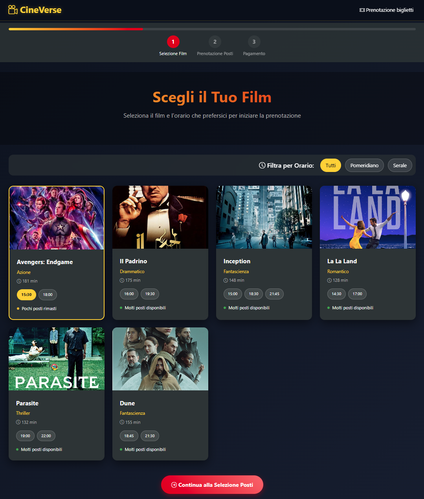
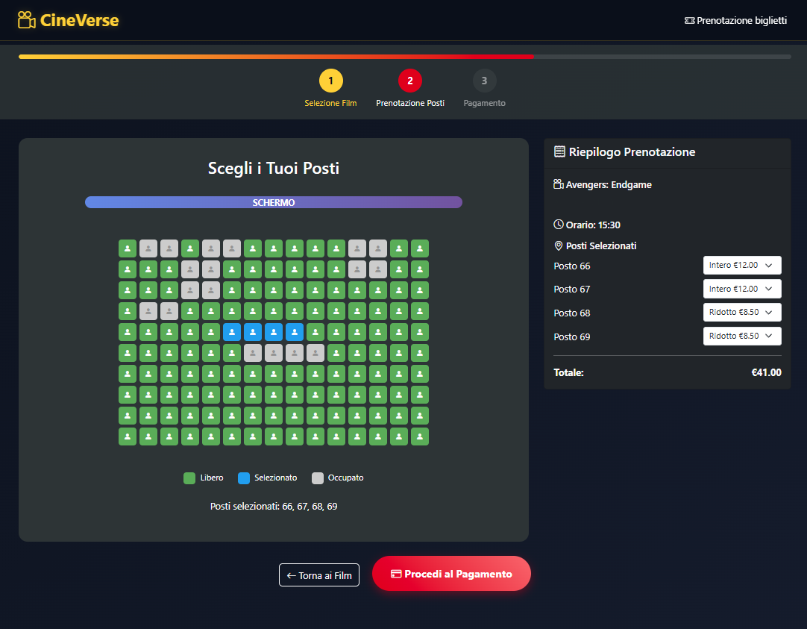
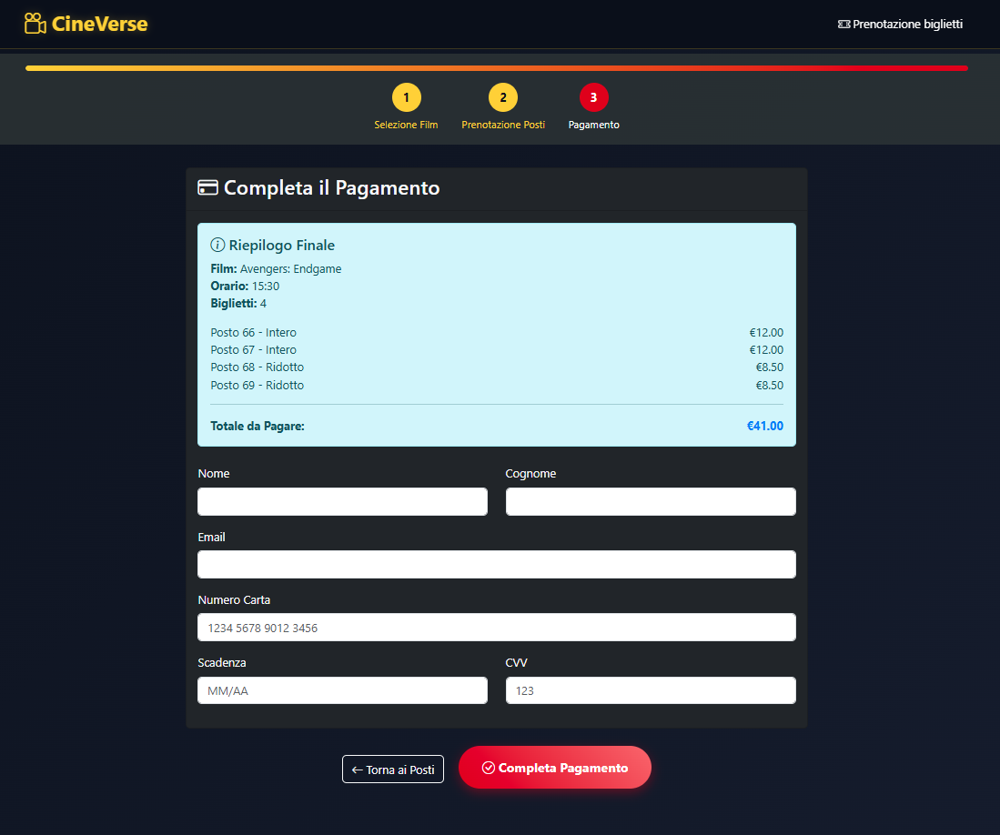

# CineVerse - Sistema di Prenotazione Cinema

Un sistema moderno e intuitivo per la prenotazione di biglietti del cinema, sviluppato con JavaScript vanilla e Bootstrap. L'applicazione offre un'esperienza utente fluida attraverso tre step principali: selezione del film, scelta dei posti e pagamento.

## Caratteristiche Principali

- **Selezione Film**: Catalogo di film con filtri per orario e disponibilità in tempo reale
- **Mappa Posti Interattiva**: Griglia visuale 15x10 con posti liberi, occupati e selezionabili
- **Tipi Biglietto**: Supporto per biglietti interi e ridotti con prezzi differenziati
- **Sistema Pagamento**: Form di pagamento con validazione e conferma
- **Design Responsive**: Interfaccia ottimizzata per desktop e mobile
- **Tema Scuro**: Design moderno con palette colori cinematografica
- **Persistenza Dati**: Utilizzo di localStorage per mantenere lo stato delle prenotazioni

## Demo Live

[Visualizza la Demo](https://francescodib.github.io/CineVerse-booking/) 

## Screenshots





## Tecnologie Utilizzate

- **HTML5** - Struttura semantica
- **CSS3** - Styling avanzato con CSS Custom Properties
- **JavaScript ES6+** - Logica applicativa moderna
- **Bootstrap 5.3.7** - Framework CSS responsivo
- **Bootstrap Icons** - Iconografia
- **LocalStorage API** - Persistenza dati lato client

## Installazione e Utilizzo

### Prerequisiti

- Browser moderno con supporto ES6+
- Server web locale (opzionale, per sviluppo)

### Installazione

1. **Clona il repository**
   ```bash
   git clone https://github.com/Francescodib/CineVerse-booking.git
   cd cineverse
   ```

2. **Avvia un server locale** (opzionale ma consigliato)
   ```bash
   # Con Python
   python -m http.server 8000
   
   # Con Node.js
   npx serve .
   
   # Con PHP
   php -S localhost:8000
   ```

3. **Apri nel browser**
   - Con server locale: `http://localhost:8000`
   - Oppure apri direttamente `index.html`

## Struttura del Progetto

```
cineverse/
├── index.html              # Pagina principale
├── css/
│   └── style.css          # Stili personalizzati
├── src/
│   ├── main.js            # Logica principale dell'applicazione
│   ├── app-data.js        # Dati dei film e configurazione
│   └── local_storage.js   # Gestione localStorage
├── assets/
│   ├── img/               # Immagini dei film (poster)
│   └── screenshots/       # Screenshot per documentazione
└── README.md              # Documentazione
```

## Funzionamento

### Step 1: Selezione Film
- Visualizza il catalogo dei film disponibili
- Filtra per orario (pomeridiano/serale)
- Seleziona film e orario desiderato
- Visualizza disponibilità posti in tempo reale

### Step 2: Selezione Posti
- Mappa interattiva della sala (15x10 posti)
- Selezione multipla dei posti
- Scelta tipo biglietto (intero/ridotto)
- Calcolo automatico del totale

### Step 3: Pagamento
- Form di pagamento con validazione
- Riepilogo finale della prenotazione
- Simulazione elaborazione pagamento
- Generazione codice prenotazione

## Configurazione

### Aggiungere Nuovi Film

Modifica il file `src/app-data.js`:

```javascript
const APP_DATA = {
  films: [
    {
      id: 7,
      title: "Nuovo Film",
      genre: "Genere",
      duration: "120 min",
      description: "Descrizione del film",
      poster: "./assets/img/nuovo-film.jpg",
      showtimes: [
        { time: "18:00", type: "serale", availability: "available" }
      ]
    }
  ]
}
```

### Modificare Prezzi Biglietti

```javascript
ticketPrices: {
  full: 12.0,    // Prezzo intero
  reduced: 8.5   // Prezzo ridotto
}
```

### Personalizzare Posti Occupati

Aggiungi configurazioni in `initialOccupiedSeats`:

```javascript
"filmId_orario": [2, 3, 5, 6, 12, 13] // Array di posti occupati
```

## Personalizzazione Tema

Il tema utilizza CSS Custom Properties per facile personalizzazione:

```css
:root {
  --primary-dark: #0a0e1a;     /* Colore primario scuro */
  --secondary-dark: #1a1f35;   /* Colore secondario */
  --accent-gold: #ffd700;      /* Oro per accenti */
  --accent-red: #e50914;       /* Rosso per azioni */
  --text-light: #ffffff;       /* Testo chiaro */
  --text-muted: #b3b3b3;       /* Testo attenuato */
}
```

## Funzionalità Debug

Apri la console del browser per accedere a funzioni di debug:

```javascript
// Visualizza statistiche occupazione
console.log(getOccupancyStats());

// Resetta tutte le prenotazioni
resetAllBookings();
```

## Compatibilità Browser

- Chrome 60+
- Firefox 55+
- Safari 12+
- Edge 79+

## Contributi

I contributi sono benvenuti! Per contribuire:

1. Fork del progetto
2. Crea un branch per la feature (`git checkout -b feature/NuovaFeature`)
3. Commit delle modifiche (`git commit -m 'Aggiunta NuovaFeature'`)
4. Push del branch (`git push origin feature/NuovaFeature`)
5. Apri una Pull Request

### Linee Guida

- Mantieni lo stile di codice consistente
- Aggiungi commenti per logiche complesse
- Testa le modifiche su diversi browser
- Aggiorna la documentazione se necessario

## Roadmap

- Autenticazione utenti - Sistema login/registrazione
- Database backend - Persistenza dati server-side
- Pagamento reale - Integrazione gateway di pagamento
- Notifiche email - Conferma prenotazione via email
- Admin panel - Gestione film e orari
- Supporto multi-lingua
- Progressive Web App
- API REST per app mobile

## Note

- I dati delle prenotazioni sono memorizzati solo localmente
- Il sistema di pagamento è simulato a scopo dimostrativo
- Le immagini dei poster potrebbero non caricarsi se i file non esistono

## Licenza

Questo progetto è rilasciato sotto licenza MIT. Vedi il file [LICENSE](LICENSE) per i dettagli.

## Autore

**Francesco di Biase** - Sviluppatore Full Stack

- GitHub: [@Francescodib](https://github.com/Francescodib)
- LinkedIn: [@Francescodibiase79](https://www.linkedin.com/in/francescodibiase79/)
- Email: info@francescodibiase.com

## Ringraziamenti

- Bootstrap team per il framework CSS
- Bootstrap Icons per le icone
- Comunità open source per l'ispirazione

---

Se questo progetto ti è stato utile, lascia una stella su GitHub!

## Link Utili

- [Bootstrap Documentation](https://getbootstrap.com/docs/)
- [MDN Web Docs](https://developer.mozilla.org/)
- [JavaScript ES6+ Features](https://github.com/lukehoban/es6features)